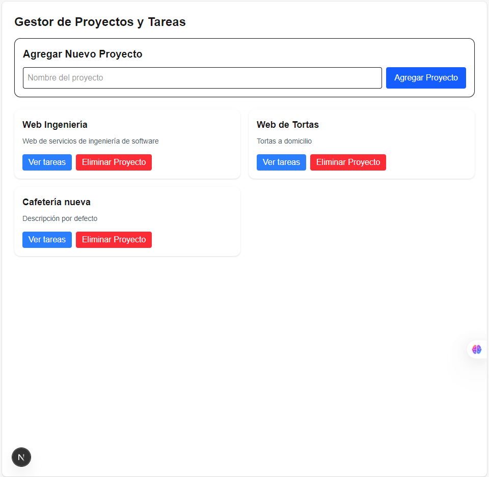

# Task Manager App — Inlaze

Gestor de tareas construido como prueba técnica, utilizando una arquitectura de microservicios.



## 🧱 Arquitectura

Este proyecto está dividido en varios microservicios y un frontend, siguiendo los principios de una arquitectura distribuida:

task-manager-inlaze/
├── auth-service/ → Servicio de autenticación (JWT)
├── projects-service/ → Servicio de gestión de proyectos
├── tasks-service/ → Servicio de gestión de tareas
├── comments-service/ → (opcional) Comentarios sobre tareas
├── gateway/ → API Gateway (NestJS - WIP)
├── frontend/ → Interfaz web (Next.js)

## 🛠️ Tecnologías

### Backend:

- [NestJS](https://nestjs.com/) (TypeScript)
- **PostgreSQL** (para `tasks-service` y `projects-service` - confirmación de la DB usada)
- JSON Web Tokens (JWT) para autenticación
- TypeORM (ORM para interacción con la base de datos)
- Docker (WIP)

### Frontend:

- [Next.js 14 (App Router)](https://nextjs.js.org/)
- TailwindCSS (para estilos rápidos y modernos)
- Fetch API (para interactuar con las APIs)
- Context API (opcional)
- Protección de rutas con JWT (gestión de autenticación del usuario)
- Headless UI (para componentes accesibles y sin estilo)

---

## ▶️ ¿Cómo correrlo?

### 1. Clona el repositorio

```bash
git clone [https://github.com/DiegoGoGo03/Tasks_Inlaze.git](https://github.com/DiegoGoGo03/Tasks_Inlaze.git)
cd Tasks_Inlaze
```

### 2\. Configura las variables de entorno

Crea un archivo `.env` en cada carpeta de microservicio (`auth-service`, `projects-service`, `tasks-service`, `comments-service`) con las variables de entorno necesarias para la conexión a tu base de datos y la configuración JWT.

**Ejemplo para los servicios de NestJS (`tasks-service`, `projects-service`):**

```
DATABASE_HOST=localhost
DATABASE_PORT=5432
DATABASE_USER=tu_usuario_pg
DATABASE_PASSWORD=tu_contraseña_pg
DATABASE_NAME=taskmanager # Asegúrate que este nombre sea consistente entre servicios
JWT_SECRET=tu_secreto_jwt
```

**(Ajusta `JWT_SECRET` y las credenciales de DB según tu configuración local.)**

### 3\. Levanta los microservicios

En cada carpeta de microservicio:

```bash
cd auth-service # O projects-service, tasks-service, comments-service
npm install
npm run start:dev
```

Asegúrate de que tus bases de datos estén corriendo (ej. PostgreSQL en Docker o localmente).

### 4\. Levanta el frontend

```bash
cd frontend
npm install
npm run dev
```

Abre [http://localhost:3000](https://www.google.com/search?q=http://localhost:3000) para ver la app.

---

## ✅ Funcionalidades Implementadas

- ✅ Registro y login de usuarios con protección JWT.
- ✅ Creación, visualización y eliminación de **proyectos**.
- ✅ Creación, visualización (dentro de un modal interactivo) y eliminación de **tareas asociadas a proyectos específicos**.
- ✅ Interfaz de usuario limpia y responsiva construida con Next.js y TailwindCSS.
- ✅ Gestión de estado de la aplicación para una experiencia de usuario fluida.

---

## 💡 Desafíos y Aprendizajes Clave

Durante el desarrollo de este proyecto, se presentaron y superaron varios retos importantes:

- **Gestión de Dependencias en Monorepo:** Coordinar `node_modules` y scripts de inicio en una estructura de monorepo.
- **Configuración de TypeORM y Persistencia de Datos:** Asegurar la correcta configuración de TypeORM con PostgreSQL, especialmente la propiedad `synchronize` para la persistencia de datos en desarrollo.
  - **Resolución de Errores de Clave Foránea:** Diagnóstico y solución de errores de violación de integridad referencial (`FK_...`) en la base de datos, lo cual fue crítico para la correcta relación entre tareas y proyectos. Esto implicó una cuidadosa verificación de la configuración de la base de datos y la sincronización de esquemas.
- **Comunicación Frontend-Backend y Errores HTTP:** Implementación de llamadas a la API (Fetch API) y manejo robusto de respuestas HTTP, incluyendo errores 500 y mensajes detallados para el usuario.
- **Manejo de Estado Complejo en Frontend:** Gestión de múltiples estados (`projects`, `tasks`, `selectedProjectId`, `openModal`, `newTaskTitle`, `newProjectName`) para una interfaz de usuario dinámica y reactiva.
- **Autenticación JWT:** Implementación y uso consistente de tokens JWT para proteger las rutas de la API, tanto para operaciones de lectura como de escritura.

---

## 🧩 Pendiente por implementar (Roadmap)

- [ ] Edición de tareas y proyectos existentes.
- [ ] Implementación completa de la funcionalidad de comentarios por tarea.
- [ ] Desarrollo de una Pasarela API Gateway robusta para centralizar el acceso a los microservicios.
- [ ] Dockerización completa de todos los microservicios para facilitar el despliegue y la gestión de entornos.
- [ ] Implementación de pruebas (unitarias, de integración y end-to-end) para asegurar la calidad del código.

---

## 👨‍💻 Autor

Desarrollado por **Diego Gómez** como parte de una prueba técnica para **Inlaze**.

- LinkedIn → [https://www.linkedin.com/in/diego-felipe-gomezg/]
- GitHub → [(https://github.com/DiegoGoGo03)]

---

## 📄 Licencia

MIT

## Documentación de Postman

https://documenter.getpostman.com/view/37240832/2sB34ZqPQ5
